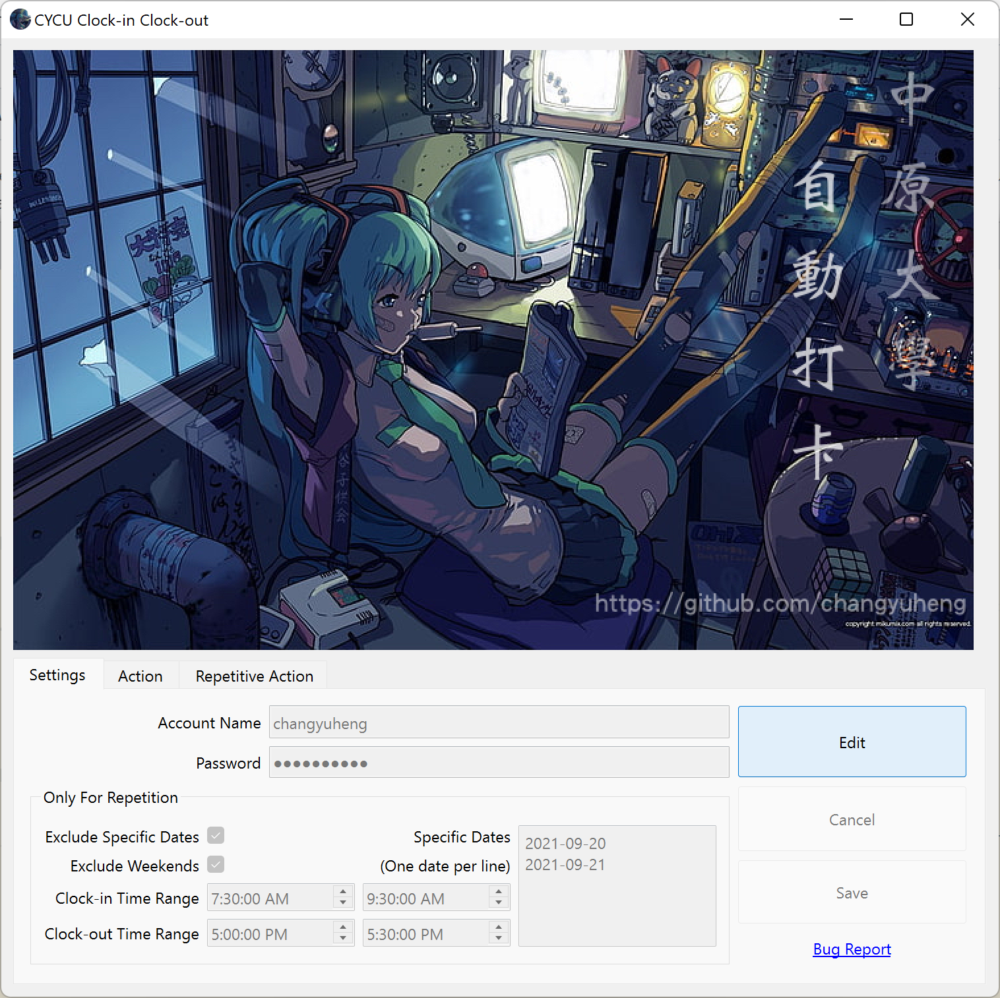
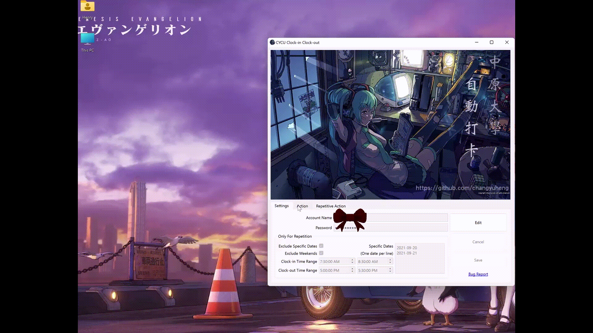

# CYCU Clock-in Clock-out App 中原大學 自動打卡




## Usage

Just download the program from the [release page](https://github.com/changyuheng/cycu-clock-in-clock-out-app/releases) and execute it. You'll get it instantly.

## Development

### Environment

1. [Python 3.9](https://www.python.org/)
2. [poetry](https://python-poetry.org/)

### Design Concepts

1. [Object-oriented programming](https://en.wikipedia.org/wiki/Object-oriented_programming)
2. [Model–view–viewmodel (MVVM)](https://en.wikipedia.org/wiki/Model%E2%80%93view%E2%80%93viewmodel)

### Key Libraries

1. [Qt for Python 6](https://www.qt.io/qt-for-python)
2. [Selenium 4](https://www.selenium.dev/)

### Packaging

```
poetry run pyinstaller --clean app.spec
```
